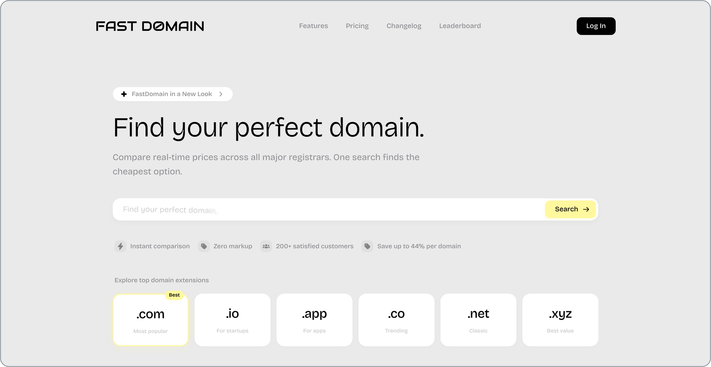
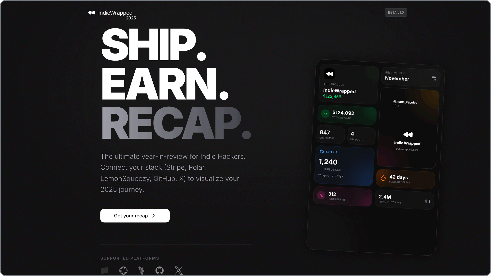
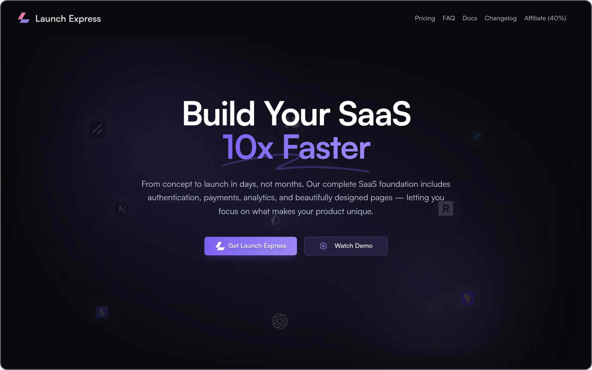
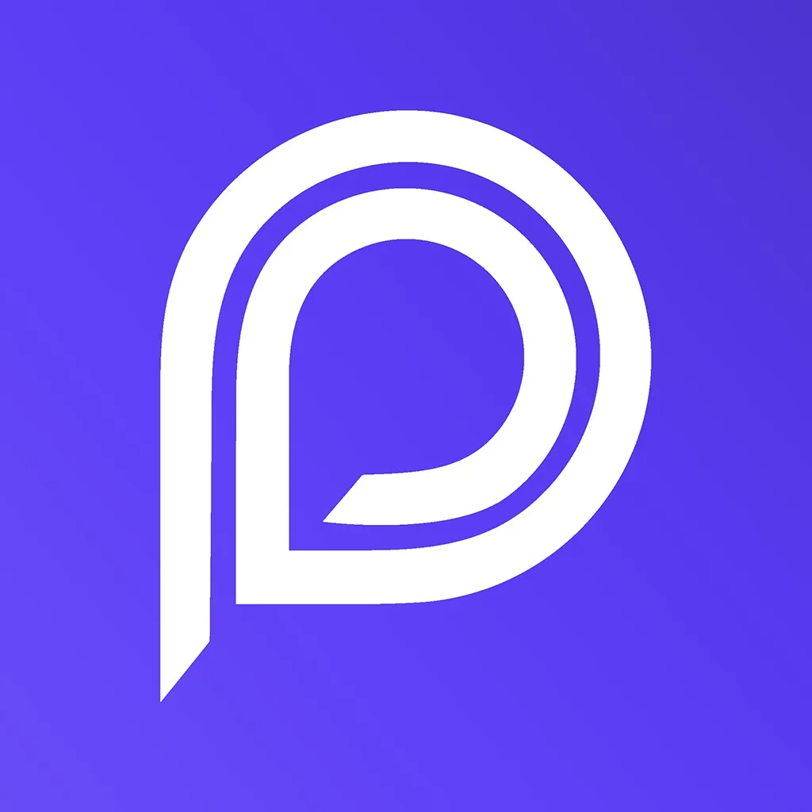

![Nico Epp — Full Stack Developer · AI Engineer](https://shieldcn.dev/header/gradient.svg?title=Nico+Epp&subtitle=Full+Stack+Developer+%C2%B7+AI+Engineer&logo=data%3Aimage%2Fsvg%2Bxml%3Bbase64%2CPHN2ZyB4bWxucz0iaHR0cDovL3d3dy53My5vcmcvMjAwMC9zdmciIHZpZXdCb3g9IjAgMCAyODQgMTE0Ij48cGF0aCBkPSJNMTc5LjM3IDBDMTg4LjgyIDAgMTk2LjggMy42MiAyMDIuMjcgMTAuMDhDMjA3LjYyIDE2LjQgMjEwLjA0IDI0LjggMjA5Ljg5IDMzLjYyTDIwOS44OSAzMy42N0wyMDkuODkgMzMuNzJMMjA5Ljg1IDM0LjYzQzIwOS40IDQ0LjAzIDIwNi40MSA1My40OSAxOTkuODYgNjMuNThDMTkyLjM4IDc1LjExIDE4Mi4yIDg1LjAzIDE3MC41NCA5Mi44NUMxNzYuMzQgOTYuNCAxODMuODkgOTguNTEgMTkzLjQ2IDk4LjUxQzIyNy4zMiA5OC41MSAyNTYuNTkgNzEuMzcgMjY0LjEzIDMwLjc5QzI2NS42MiAyMi43NyAyNjcuNCAxNS44MSAyNjguMjUgOC41NkMyNjguNzMgNC40NyAyNzIuNDQgMS41NiAyNzYuNTIgMi4wNEMyODAuNiAyLjUyIDI4My41MiA2LjIyIDI4My4wNCAxMC4zQzI4Mi4xMiAxOC4xNCAyODAuMDIgMjYuNzcgMjc4Ljc3IDMzLjUxQzI3MC4yNSA3OS4zNyAyMzYuMTYgMTEzLjQgMTkzLjQ2IDExMy40QzE3OC4zMiAxMTMuNCAxNjUuNzcgMTA5LjA1IDE1Ni40NiAxMDAuOTNDMTQxLjI5IDEwOC4zMSAxMjQuNjUgMTEyLjQxIDEwOC42NCAxMTIuNDFDOTYuMzQgMTEyLjQxIDg2LjUyIDEwOC45MSA4MC4zNyAxMDEuNTVDNzQuMzMgOTQuMzEgNzMuMTMgODQuODkgNzQuNTMgNzUuNzhDNzQuNTUgNzUuNjEgNzQuNTcgNzUuNDQgNzQuNTkgNzUuMjdDNzYuNyA2Mi4xMyA3OS40NiA0OS45MyA4MC42OCAzNy41NUM4MS4yOSAzMC41MiA3OS42NyAyNS40NSA3Ny4wMiAyMi4yNkM3NC40OCAxOS4xOSA3MC4xOCAxNi44OSA2My4yOCAxNi44OUM1My44OSAxNi44OSA0NC41MSAyMS45MyAzNi4zMyAzMy4xOUMyOC4xIDQ0LjUyIDIxLjUgNjEuNjggMTguMTkgODQuMjNDMTguMTkgODQuMjQgMTguMTkgODQuMjUgMTguMTkgODQuMjZDMTcuMDkgOTEuNzIgMTUuOTcgOTkuMTcgMTQuOCAxMDYuNjNDMTQuMTYgMTEwLjY5IDEwLjM1IDExMy40NyA2LjI5IDExMi44M0MyLjIzIDExMi4xOS0wLjU1IDEwOC4zOCAwLjA5IDEwNC4zMkM1LjA2IDcyLjc1IDguOTcgNDIuMTQgMTMuNzMgMTAuMzNDMTQuMzQgNi4yNiAxOC4xMyAzLjQ2IDIyLjE5IDQuMDdDMjYuMjYgNC42OCAyOS4wNiA4LjQ3IDI4LjQ2IDEyLjUzQzI4LjA1IDE1LjIyIDI3LjY1IDE3LjkyIDI3LjI2IDIwLjYxQzM2Ljk5IDguOTYgNDkuMzEgMiA2My4yOCAyQzczLjc0IDIgODIuNiA1LjY1IDg4LjQ5IDEyLjc2Qzk0LjI4IDE5Ljc0IDk2LjM3IDI5LjA2IDk1LjUxIDM4Ljg4TDk1LjUgMzguOTJMOTUuNSAzOC45Nkw5NS4zOCA0MC4xN0M5NC4wNSA1Mi42NSA5MS4xNyA2NS45NiA4OS4zMyA3Ny4zOUM4OS4zMiA3Ny41NCA4OS4zIDc3LjcgODkuMjggNzcuODVDODguMjEgODQuNTMgODkuNDEgODkuMTQgOTEuOCA5MkM5NC4xNCA5NC44MSA5OC45NSA5Ny41MiAxMDguNjQgOTcuNTJDMTIxLjI5IDk3LjUyIDEzNC40NyA5NC40OSAxNDYuNyA4OS4wNUMxNDEuMjMgNzkuNjcgMTM4LjY3IDY4LjMxIDEzOC42NyA1Ni4wOEMxMzguNjcgNDEuMiAxNDIuNTggMjcuNTIgMTQ5LjUyIDE3LjM0QzE1Ni40NyA3LjEzIDE2Ni44NSAwIDE3OS4zNyAwWk0xNzkuMzcgMTQuODlDMTczLjAzIDE0Ljg5IDE2Ni43OSAxOC40MyAxNjEuODIgMjUuNzFDMTU2Ljg1IDMzLjAyIDE1My41NiA0My42NiAxNTMuNTYgNTYuMDhDMTUzLjU2IDY2LjU5IDE1NS44IDc1LjM0IDE1OS44NSA4Mi4wNEMxNzAuOSA3NS4wNyAxODAuNTMgNjYuMDMgMTg3LjM3IDU1LjQ4QzE5Mi43OSA0Ny4xMiAxOTQuNzkgNDAuMDEgMTk1IDMzLjM0QzE5NS4xIDI3LjMgMTkzLjQyIDIyLjY4IDE5MC45IDE5LjdDMTg4LjQ5IDE2Ljg1IDE4NC44IDE0Ljg5IDE3OS4zNyAxNC44OVoiLz48L3N2Zz4%3D&mode=light&image=https%3A%2F%2Fraw.githubusercontent.com%2FNiggo2k%2FNiggo2k%2Fmain%2Fassets%2Fheader-bg.jpg&overlay=0)

## Overview

I'm Nico, a full-stack developer and AI engineer based in Germany.

I build web products from interface and APIs to databases, authentication, payments, testing and deployment. 

I have a B.Eng. in Softwaretechnik und Medieninformatik from Hochschule Esslingen and practical experience building SaaS and AI applications.

If you want to see what else I've made, explore my latest works down below or at [bynico.dev](https://bynico.dev).

[Portfolio](https://bynico.dev) · [LinkedIn](https://www.linkedin.com/in/nicoepp/) · [Email](mailto:nico.epp@gmx.de)

## Selected products

**[Ora Mail](https://useora.co)** — AI email client · in development

Building inbox classification, reply drafts and thread summaries. Reworked agent and search modules and developed email-provider integrations.

**TypeScript · Next.js · Hono · tRPC · Drizzle ORM · Cloudflare Workers · AI SDK · Mastra**

---

**[FastDomain](https://fastdomain.io)** — domain price comparison

**TypeScript · Next.js · Hono · tRPC · PostgreSQL · Drizzle ORM · Cloudflare Workers**

Built a product that compares domain prices across multiple registrars in real time. **Reached nearly 300 registered users.**

---

**[IndieWrapped](https://indiewrapped.com)** — year in review for indie makers

**Next.js · TypeScript · PostgreSQL · Drizzle ORM · Stripe · Polar · Lemon Squeezy · Grok**

Built shareable summaries of product, payment, GitHub and social data, turning revenue, commits and growth into graphics with AI-generated insights.

---

**[Launch Express](https://web.archive.org/web/20251214204510/https://www.launch-express.com/)** — SaaS Boilerplate

**Next.js · TypeScript · Prisma · PostgreSQL · Better Auth · Stripe · Lemon Squeezy**

Built authentication with email, OAuth and magic links; Stripe and Lemon Squeezy subscriptions with webhooks and a customer portal; and reusable dashboard and email templates.

---

Also built: Adapt2Move Mobility · Smart Parcel Box · Homematic Dashboard · Occupancy Planner — [More work on my portfolio](https://bynico.dev).

## Experience

-  **Paroot Cashback — Co-Founder & Full-Stack Developer, March 2022–May 2026.** Built frontend, backend, database and deployment for a cashback platform integrating **270+ affiliate partner shops**. Migrated PHP to Laravel, built a Chrome extension with shop detection and cashback API integration, and automated deployment with GitLab CI/CD.
-  **Hydra Newmedia — Frontend Developer Intern, September 2023–February 2024.** Developed interactive Vue.js e-learning modules from Adobe XD designs through deployment, with responsive implementation and quality checks across colleagues' projects.

## Stack

![OpenAI](https://img.shields.io/badge/OpenAI-000000?style=for-the-badge&logo=data%3Aimage%2Fsvg%2Bxml%3Bbase64%2CPHN2ZyB4bWxucz0iaHR0cDovL3d3dy53My5vcmcvMjAwMC9zdmciIHZpZXdCb3g9IjAgMCAyNTYgMjYwIiBmaWxsPSIjRkZGRkZGIj48cGF0aCBkPSJNMjM5LjE4NCAxMDYuMjAzYTY0LjcxNiA2NC43MTYgMCAwIDAtNS41NzYtNTMuMTAzQzIxOS40NTIgMjguNDU5IDE5MSAxNS43ODQgMTYzLjIxMyAyMS43NEE2NS41ODYgNjUuNTg2IDAgMCAwIDUyLjA5NiA0NS4yMmE2NC43MTYgNjQuNzE2IDAgMCAwLTQzLjIzIDMxLjM2Yy0xNC4zMSAyNC42MDItMTEuMDYxIDU1LjYzNCA4LjAzMyA3Ni43NGE2NC42NjUgNjQuNjY1IDAgMCAwIDUuNTI1IDUzLjEwMmMxNC4xNzQgMjQuNjUgNDIuNjQ0IDM3LjMyNCA3MC40NDYgMzEuMzZhNjQuNzIgNjQuNzIgMCAwIDAgNDguNzU0IDIxLjc0NGMyOC40ODEuMDI1IDUzLjcxNC0xOC4zNjEgNjIuNDE0LTQ1LjQ4MWE2NC43NjcgNjQuNzY3IDAgMCAwIDQzLjIyOS0zMS4zNmMxNC4xMzctMjQuNTU4IDEwLjg3NS01NS40MjMtOC4wODMtNzYuNDgzWm0tOTcuNTYgMTM2LjMzOGE0OC4zOTcgNDguMzk3IDAgMCAxLTMxLjEwNS0xMS4yNTVsMS41MzUtLjg3IDUxLjY3LTI5LjgyNWE4LjU5NSA4LjU5NSAwIDAgMCA0LjI0Ny03LjM2N3YtNzIuODVsMjEuODQ1IDEyLjYzNmMuMjE4LjExMS4zNy4zMi40MDkuNTYzdjYwLjM2N2MtLjA1NiAyNi44MTgtMjEuNzgzIDQ4LjU0NS00OC42MDEgNDguNjAxWm0tMTA0LjQ2Ni00NC42MWE0OC4zNDUgNDguMzQ1IDAgMCAxLTUuNzgxLTMyLjU4OWwxLjUzNC45MjEgNTEuNzIyIDI5LjgyNmE4LjMzOSA4LjMzOSAwIDAgMCA4LjQ0MSAwbDYzLjE4MS0zNi40MjV2MjUuMjIxYS44Ny44NyAwIDAgMS0uMzU4LjY2NWwtNTIuMzM1IDMwLjE4NGMtMjMuMjU3IDEzLjM5OC01Mi45NyA1LjQzMS02Ni40MDQtMTcuODAzWk0yMy41NDkgODUuMzhhNDguNDk5IDQ4LjQ5OSAwIDAgMSAyNS41OC0yMS4zMzN2NjEuMzlhOC4yODggOC4yODggMCAwIDAgNC4xOTUgNy4zMTZsNjIuODc0IDM2LjI3Mi0yMS44NDUgMTIuNjM2YS44MTkuODE5IDAgMCAxLS43NjcgMEw0MS4zNTMgMTUxLjUzYy0yMy4yMTEtMTMuNDU0LTMxLjE3MS00My4xNDQtMTcuODA0LTY2LjQwNXYuMjU2Wm0xNzkuNDY2IDQxLjY5NS02My4wOC0zNi42M0wxNjEuNzMgNzcuODZhLjgxOS44MTkgMCAwIDEgLjc2OCAwbDUyLjIzMyAzMC4xODRhNDguNiA0OC42IDAgMCAxLTcuMzE2IDg3LjYzNXYtNjEuMzkxYTguNTQ0IDguNTQ0IDAgMCAwLTQuNC03LjIxM1ptMjEuNzQyLTMyLjY5LTEuNTM1LS45MjItNTEuNjE5LTMwLjA4MWE4LjM5IDguMzkgMCAwIDAtOC40OTIgMEw5OS45OCA5OS44MDhWNzQuNTg3YS43MTYuNzE2IDAgMCAxIC4zMDctLjY2NWw1Mi4yMzMtMzAuMTMzYTQ4LjY1MiA0OC42NTIgMCAwIDEgNzIuMjM2IDUwLjM5MXYuMjA1Wk04OC4wNjEgMTM5LjA5N2wtMjEuODQ1LTEyLjU4NWEuODcuODcgMCAwIDEtLjQxLS42MTRWNjUuNjg1YTQ4LjY1MiA0OC42NTIgMCAwIDEgNzkuNzU3LTM3LjM0NmwtMS41MzUuODctNTEuNjcgMjkuODI1YTguNTk1IDguNTk1IDAgMCAwLTQuMjQ2IDcuMzY3bC0uMDUxIDcyLjY5N1ptMTEuODY4LTI1LjU4IDI4LjEzOC0xNi4yMTcgMjguMTg4IDE2LjIxOHYzMi40MzRsLTI4LjA4NiAxNi4yMTgtMjguMTg4LTE2LjIxOC0uMDUyLTMyLjQzNFoiLz48L3N2Zz4%3D)

![Mastra](https://img.shields.io/badge/Mastra-000000?style=for-the-badge&logo=data%3Aimage%2Fsvg%2Bxml%3Bbase64%2CPHN2ZyB4bWxucz0iaHR0cDovL3d3dy53My5vcmcvMjAwMC9zdmciIHZpZXdCb3g9IjExNiAxMTYgNDI5IDI2NiIgZmlsbD0iI0ZGRkZGRiI%2BPHBhdGggZD0iTTE3NC4zNTggMjY2LjMzMkMyMDYuNTkxIDI2Ni4zMzIgMjMyLjcyNSAyOTIuMjIyIDIzMi43MjUgMzI0LjE2MkMyMzIuNzI1IDM1Ni4xMDMgMjA2LjU5MSAzODEuOTkyIDE3NC4zNTggMzgxLjk5MkMxNDIuMTI4IDM4MS45OSAxMTYgMzU2LjEwMSAxMTYgMzI0LjE2MkMxMTYgMjkyLjIyMyAxNDIuMTI4IDI2Ni4zMzQgMTc0LjM1OCAyNjYuMzMyWiIvPjxwYXRoIGQ9Ik0yNTAuNzU3IDExNkMyODIuOTg4IDExNiAzMDkuMTIxIDE0MS44OTEgMzA5LjEyMyAxNzMuODNDMzA5LjEyMyAxNzYuNTUgMzA4LjkzMyAxNzkuMjI1IDMwOC41NjUgMTgxLjg0NEMzMDUuNjI0IDIwMi44MDkgMzAxLjI5OCAyMjYuNDU5IDMxMy4yMTIgMjQ0LjAyOEwzMjYuOTI2IDI2NC4yNTJMMzMwLjMxOCAyNjguMzc4QzMzMC45NDEgMjY5LjEzNSAzMzIuMTEzIDI2OS4wOTQgMzMyLjY4MSAyNjguMjk0TDMzNS41NSAyNjQuMjUyTDM0OC4wOTMgMjQ1Ljc1M0MzNjAuNjA1IDIyNy4zIDM1Ni4wNjkgMjAyLjM2NyAzNTMuOTE5IDE4MC4yMzhDMzUzLjc0IDE3OC4zOTUgMzUzLjY0OSAxNzYuNTI3IDM1My42NDkgMTc0LjYzOEMzNTMuNjQ5IDE0Mi42OTkgMzc5Ljc3NyAxMTYuODEgNDEyLjAwNyAxMTYuODA4QzQ0NC4yMzkgMTE2LjgwOCA0NzAuMzc0IDE0Mi42OTggNDcwLjM3NCAxNzQuNjM4QzQ3MC4zNzQgMTc3Ljc0MyA0NzAuMTI2IDE4MC43OSA0NjkuNjUgMTgzLjc2MkM0NjYuNDc0IDIwMy41OTYgNDYxLjkyNCAyMjUuNTMyIDQ3Mi4wNTggMjQyLjkyM0w0NzcuODQzIDI1Mi4xOTZDNDgzLjMyOCAyNjAuOTg5IDQ5My4xNTUgMjY1Ljc2OSA1MDMuMTA3IDI2OC42NkM1MjcuMzMxIDI3NS42OTYgNTQ1LjAxOSAyOTcuODgxIDU0NS4wMiAzMjQuMTYyQzU0NS4wMiAzNTYuMTAzIDUxOC44OTMgMzgxLjk5MiA0ODYuNjYxIDM4MS45OTJDNDU0LjQyOSAzODEuOTkyIDQyOC4zMDMgMzU2LjEwMiA0MjguMzAzIDMyNC4xNjJDNDI4LjMwMyAzMjAuNzMzIDQyOC42MDQgMzE3LjM3NCA0MjkuMTgyIDMxNC4xMDlDNDMyLjY0MyAyOTQuNTU1IDQzNy4yMjIgMjcyLjg3NSA0MjcuMjA1IDI1NS42ODNMNDE0LjQ3OSAyMzMuODQyTDQxMy43MTUgMjMyLjc5NkM0MTMuMTY2IDIzMi4wNDQgNDEyLjA1MyAyMzIuMDE1IDQxMS40NjYgMjMyLjczOEwzOTcuODY4IDI1Mi43OTJDMzg1LjY3NiAyNzAuNzczIDM5MC4yNjIgMjk1LjA0OSAzOTMuMTI0IDMxNi41MjVDMzkzLjQ1NyAzMTkuMDI0IDM5My42MjggMzIxLjU3MyAzOTMuNjI4IDMyNC4xNjJDMzkzLjYyOCAzNTYuMTAzIDM2Ny40OTQgMzgxLjk5MiAzMzUuMjYyIDM4MS45OTJDMzAzLjAzIDM4MS45OTEgMjc2LjkwNCAzNTYuMTAyIDI3Ni45MDQgMzI0LjE2MkMyNzYuOTA0IDMwMS40NzQgMjgwLjQ0MiAyNzYuMTQ2IDI2Ny42NzMgMjU3LjMxNEwyNjYuNjYyIDI1NS44MjJDMjU2LjQwNSAyNDAuNjk3IDIzOC4xOTQgMjMzLjE5MiAyMjIuMTY5IDIyNC4yNTNDMjA0LjQgMjE0LjM0MiAxOTIuMzk4IDE5NS40NzcgMTkyLjM5OCAxNzMuODNDMTkyLjQgMTQxLjg5MiAyMTguNTI2IDExNi4wMDEgMjUwLjc1NyAxMTZaIi8%2BPC9zdmc%2B)

![Polar](https://img.shields.io/badge/Polar-0062FF?style=for-the-badge&logo=data%3Aimage%2Fsvg%2Bxml%3Bbase64%2CPHN2ZyB4bWxucz0iaHR0cDovL3d3dy53My5vcmcvMjAwMC9zdmciIHZpZXdCb3g9IjAgMCAzMDAgMzAwIiBmaWxsPSIjRkZGRkZGIj48cGF0aCBmaWxsLXJ1bGU9ImV2ZW5vZGQiIGNsaXAtcnVsZT0iZXZlbm9kZCIgZD0iTTY2LjQyOCAyNzQuMjZjNjguNDQ4IDQ2LjMzMyAxNjEuNDk3IDI4LjQwNiAyMDcuODMtNDAuMDQxIDQ2LjMzNS02OC40NDggMjguNDA4LTE2MS40OTctNDAuMDQtMjA3LjgzQzE2NS43Ny0xOS45NDYgNzIuNzIxLTIuMDE5IDI2LjM4OCA2Ni40MjgtMTkuOTQ4IDEzNC44NzgtMi4wMiAyMjcuOTI4IDY2LjQyNyAyNzQuMjZaTTQ3Ljk1NiAxMTYuNjdjLTE3LjExOSA1Mi41OTMtMTEuNDEyIDEwNS4yMjMgMTEuMjkgMTM5LjcwM0MxOC4wNCAyMTcuMzYxIDcuMjc1IDE1MC4zMDcgMzYuOTQzIDkyLjMxOGMxOC45NzEtMzcuMDgyIDUwLjYyMy02Mi45MjQgODUuNTU2LTczLjk3LTMxLjkwOSAxOC4zNjMtNTkuOTQ1IDUzLjQ2Ni03NC41NDQgOTguMzIyWm0xMjcuMzkxIDE2Ni40NjdjMzYuMDMtMTAuNTMxIDY4Ljg2NC0zNi43NTIgODguMzM4LTc0LjgxNSAyOS40MTYtNTcuNDk3IDE5LjA4My0xMjMuOTA1LTIxLjI1OC0xNjMuMDU1IDIxLjc5MyAzNC40OTYgMjcuMDQ2IDg2LjI3NSAxMC4yMDQgMTM4LjAyLTE1LjAxNiA0Ni4xMzQtNDQuMjQ2IDgxLjk1Mi03Ny4yODQgOTkuODVabTguMjgtMTYuOTA4YzI0LjMxOC0yMC44MTEgNDQuMzg5LTU1LjYyNSA1My4zMDktOTcuNDM5IDE0LjA5Ny02Ni4wOTctNC4zODUtMTI3LjU5Mi00MS44MjQtMTQ4LjExMyAxOS44NTggMjYuNzE4IDI5LjkxIDc4LjYxMyAyMy43MTIgMTM2LjY1Ni00LjczOSA0NC4zOTEtMTguMDEgODMuMjYtMzUuMTk3IDEwOC44OTZaTTYzLjcxNyAxMzEuODQ0Yy0xNC4yMDEgNjYuNTg2IDQuNjYgMTI4LjUwMSA0Mi42NTcgMTQ4LjU2MS0yMC4zNzgtMjYuMzk2LTMwLjc3Ny03OC44OTEtMjQuNDk4LTEzNy42OTQgNC42NjEtNDMuNjU3IDE3LjU3NC04MS45NzQgMzQuMzQ5LTEwNy42MTQtMjMuOTU3IDIwLjg4Ni00My42ODcgNTUuMzkyLTUyLjUwNyA5Ni43NDdabTEzNi4xMTcgMTcuNzE3YzEuMDc0IDY3LjkxMi0yMC4yNDQgMTIzLjMxNy00Ny42MTIgMTIzLjc0OC0yNy4zNjkuNDMzLTUwLjQyNS01NC4yNy01MS40OTgtMTIyLjE4Mi0xLjA3My02Ny45MTMgMjAuMjQ0LTEyMy4zMTggNDcuNjEzLTEyMy43NSAyNy4zNjgtLjQzMiA1MC40MjUgNTQuMjcxIDUxLjQ5NyAxMjIuMTg0WiIvPjwvc3ZnPg%3D%3D)

## GitHub

## Contact

